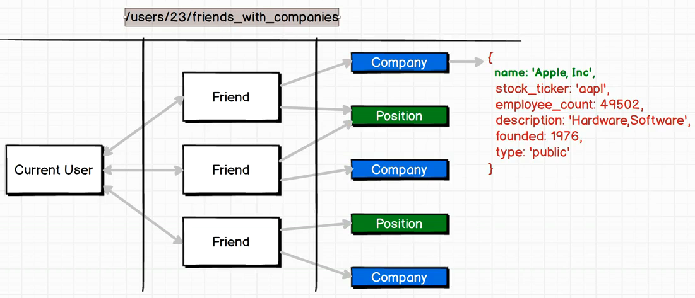

## Restful conventions
URL, Method, Operation

## Shortcoming of RESTful Routing

## Graphql is better
    https://www.howtographql.com/basics/1-graphql-is-the-better-rest/
- Overfetching: Downloading superfluous data
- Underfetching and the n+1 problem
